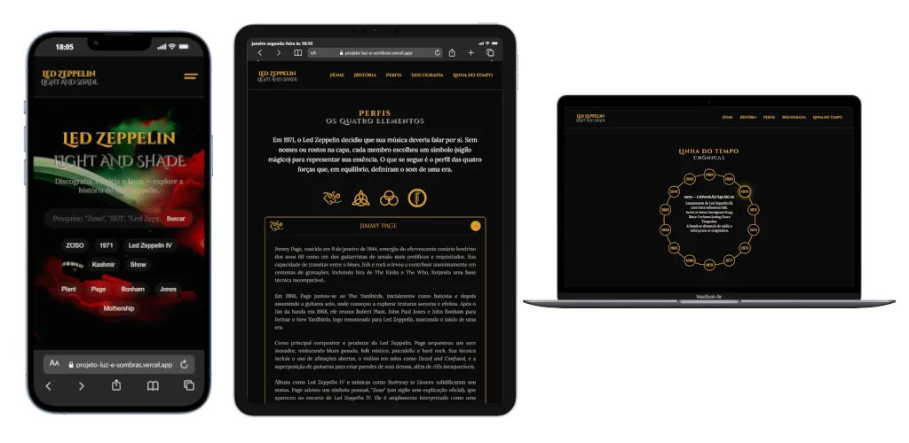

<h1 align="center">
  <span style="color: #FFD700; padding: 0 10px; border-radius: 4px;">
    Led Zeppelin — Light and Shade
  </span>
</h1>

Uma aplicação web imersiva que documenta a trajetória do Led Zeppelin, utilizando Inteligência Artificial para curadoria de conteúdo e uma arquitetura de cache local para performance otimizada, unindo a história do rock à tecnologia moderna.

[](https://projeto-luz-e-sombras.vercel.app/)
Para abrir o link em uma nova aba, utilize **Ctrl + Clique** (Windows) ou **Cmd + Clique** (Mac).


## Sobre o Projeto

O **Light and Shade** é mais do que um site estático; é um sistema híbrido que combina a robustez do Node.js com a criatividade do Google Gemini AI. O objetivo técnico foi criar uma aplicação que se mantém resiliente e atualizada. Ao invés de depender de um banco de dados fixo, o sistema prioriza a estabilidade das informações locais e, quando necessário (como em casos de ausência de dados), consulta a IA para reescrever biografias, contextos históricos e detalhes de shows, garantindo que o conteúdo seja sempre envolvente e bem redigido, sem sacrificar a velocidade de carregamento para o usuário final.

## Funcionalidades Principais

- **Geração de Conteúdo via IA:** Utiliza o modelo `gemini-2.5-flash` para gerar textos ricos sobre a história da banda, perfis dos membros e curadoria de shows icônicos.
- **Sistema de Cache Inteligente:** Implementa uma lógica de persistência que prioriza a leitura de dados locais (`data.json`). Se os dados estiverem ausentes ou incompletos, uma atualização em background é acionada para restaurar a integridade da base de dados.
- **Interface Responsiva:** Frontend moderno (HTML5/CSS3) com seções de História, Perfis (Jimmy Page, Robert Plant, John Paul Jones, John Bonham), Discografia e Linha do Tempo.
- **Busca e Navegação:** Funcionalidades de pesquisa e filtragem por tags para facilitar o acesso à vasta discografia e fatos históricos.
- **Atualização Seletiva:** O servidor executa uma rotina de verificação na inicialização (`runUpdates`), garantindo que campos dinâmicos sejam restaurados sem afetar dados manuais como discografia e linha do tempo.

## Tecnologias e Métodos

O projeto foi construído sobre uma stack leve e eficiente:

- **Backend:** Node.js com Express para servir a aplicação e gerenciar a lógica de dados.
- **AI Integration:** Google Generative AI SDK (`@google/generative-ai`) para processamento de linguagem natural.
- **Persistência de Dados:** Sistema de arquivos nativo (`fs.promises`) manipulando JSON como banco de dados local (NoSQL baseado em arquivo).
- **Frontend:** Vanilla JavaScript (ES Modules), CSS3 (com variáveis e design responsivo) e HTML5 Semântico.
- **Gerenciamento de Ambiente:** `dotenv` para segurança de chaves de API.

## Arquitetura da API

A arquitetura segue um padrão de **"Cache-First com Fallback de IA"**. O fluxo de dados opera da seguinte maneira:

1.  **Inicialização:** Ao iniciar, o servidor executa `runUpdates()`.
2.  **Verificação:** O sistema checa a presença e integridade dos dados no arquivo `data.json`.
    - _Cenário A (Dados Presentes):_ O servidor mantém o arquivo atual e prioriza a velocidade de entrega.
    - _Cenário B (Dados Ausentes/Incompletos):_ O servidor aciona o Gemini AI para reconstrução.
3.  **Geração (Se necessário):**
    - `updateHistory`: Gera um resumo histórico sucinto.
    - `updateProfiles`: Cria biografias para cada um dos 4 membros.
    - `updateShows`: Compila uma lista de shows lendários em formato JSON estruturado.
4.  **Serviço:** O Express disponibiliza o `data.json` estaticamente para que o Frontend o consuma via `fetch`, garantindo renderização instantânea para o usuário.

## Como Executar

Para rodar o projeto localmente, você precisará do Node.js instalado e uma chave de API do Google Gemini.

1.  **Clone o repositório:**

    ```bash
    git clone https://github.com/seu-usuario/projeto-luzesombra.git
    cd projeto-luzesombra
    ```

2.  **Instale as dependências:**

    ```bash
    npm install
    ```

3.  **Configure as variáveis de ambiente:**
    Crie um arquivo `.env` na raiz e adicione sua chave:

    ```env
    GOOGLE_API_KEY=sua_chave_aqui
    PORT=3000
    ```

4.  **Inicie o servidor:**
    ```bash
    node server.js
    ```
    Acesse `http://localhost:3000` no seu navegador.
